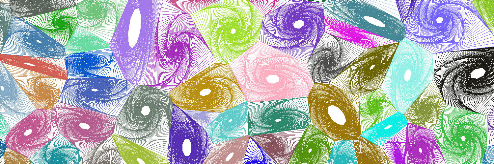
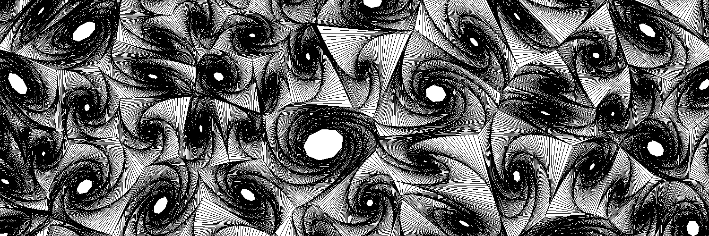

# Spyral
Draw some cool spirals!

## The goal
With Spyral you can draw cool and mesmerizing spirals!

**Note**: this is a work in progress, done quickly.
There is plenty of room for improvement.
So feel free to make some changes and improve this project :)

## How it works

1) Make convex polygons:
    1) Generate N random points (seeds)
    2) Get the Voronoi diagram from the seeds (see [scipy](https://docs.scipy.org/doc/scipy-0.18.1/reference/generated/scipy.spatial.Voronoi.html))
    3) Get a set of vertices and regions (linked vertices) from the Voronoi diagram
2) Draw spirals inside each polygon (region) generated:

    Do the follwing until a stop condition is true:
    1) Draw a line from one polygon's vertex to another.
    2) Move the vertex along the edge so that it is closer to the next vertex.
    3) Move to next vertex.

### Example

Generate a 1500*500 banner:

`raw_image(width=1500, height=500)`

output :

Generate a 1500*500 black and white banner:

`raw_image(width=1500, height=500)`

output :
